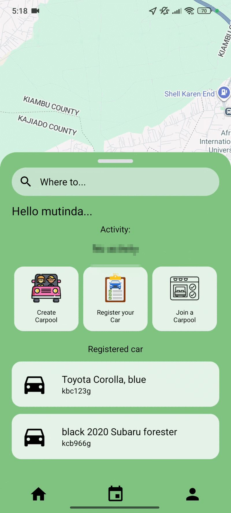

# Swoopr Android Client

This repo is the source code for the android client for the campus carpooling application and an extension of the server logic, [here](https://github.com/soipanhamisi/swooprServer).
The app connects users with verified peers traveling along similar routes, allowing them to create or join carpools, coordinate pickup and drop-off points, and share the journey with confidence.

## App look and feel

  
  
  

  
  
  

## Features
- Secure signup and email/OTP verification
- Map-based origin and destination selection
- Create and join carpools
- Trip matching and status tracking
- In-app chat for trip coordination
- Firebase-powered notifications

## Getting started
1. Clone the repository
2. Open the project in Android Studio
3. Sync Gradle dependencies
4. Run the app on an emulator or Android device

## Tech stack
- Android (Java)
- Google Maps / Places
- Firebase Messaging
- OkHttp
- Gson
- Secure token storage

## Project structure
- `app/` — Android application source
